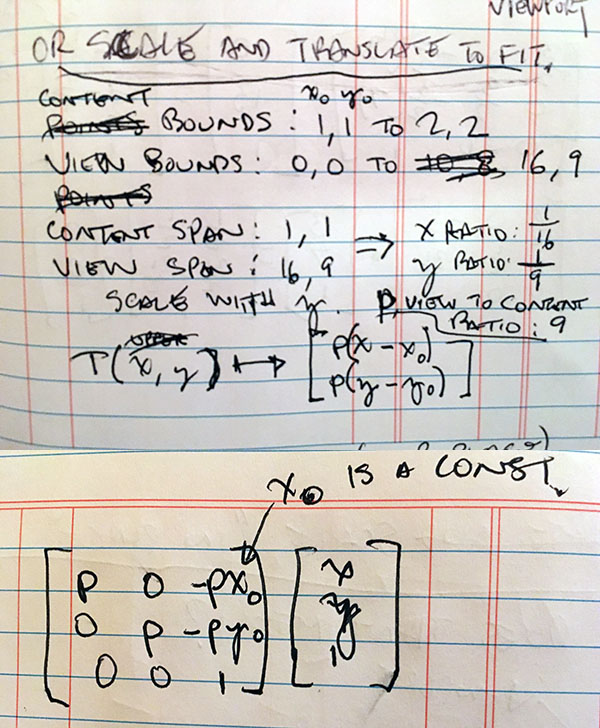
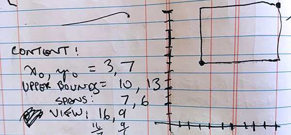
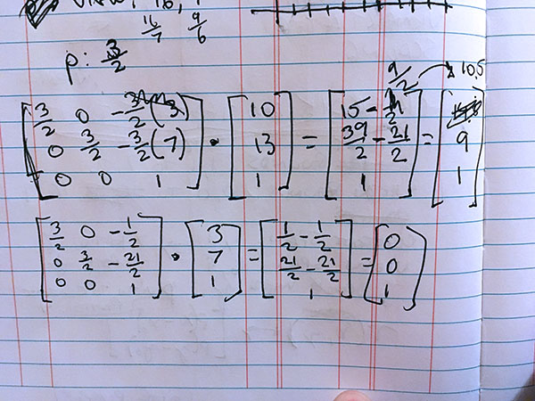
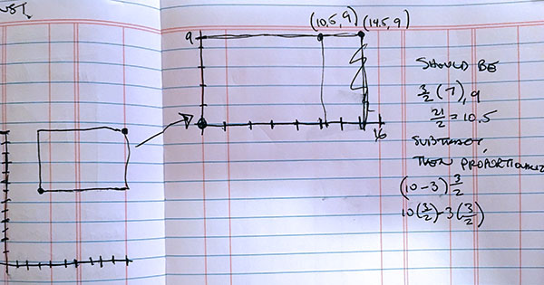

scale-to-fit
==================

Given 2D view bounds and content bounds, gives you a 3x3 transformation matrix that will scale and translate the content such that it fits to the view.

Installation
------------

    npm install scale-to-fit

Usage
-----

    var scaleToFit = require('scale-to-fit');
    console.log(JSON.stringify(
      scaleToFit({
        view: {
          left: 2,
          right: 638,
          bottom: 2,
          top: 478
        },
        content: {
          left: -10,
          right: 27,
          bottom: -50,
          top: -14
        }
      }),
    null, '  '));

Output:

    {
      a: ,
      b: ,
      c: ,
      d: ,
      e: ,
      f: ,
    }

Where `a, b, c, d, e, f` correspond to the positions in the matrix as specfied in the [SVG transform matrix definition](https://developer.mozilla.org/en-US/docs/Web/SVG/Attribute/transform):

    a c e
    b d f
    0 0 1

Algorithm
----------

Working backwards from an example in which we want content that goes from (1, 1) to (2, 2) to scale to fit to view bounded by (0, 0) to (16, 9), here is the general matrix transformation we need to apply in order to scale to fit:

Here is that transformation exercised by an example in which we want to scale content bounded by (3, 7) and (10, 13) to fit to a view bounded by (0, 0) to (16, 9).

Once we fill in the matrix with p, x0, y0, x, and y for (3, 7) and again for (10, 13), we get these multiplication operations:

This is a graph of the results:

(Ignore the (14.5, 9) point. That was a mistake.)

Development
-------------

- Clone the repo.
- `npm install`
- `make run-workspace`

Then, wzrd will say something like:

    wzrd index.js
    server started at http://localhost:9966

You can open your browser to that.

Tests
-----

Run tests with `make test`.

License
-------

The MIT License (MIT)

Copyright (c) 2016 Jim Kang

Permission is hereby granted, free of charge, to any person obtaining a copy
of this software and associated documentation files (the "Software"), to deal
in the Software without restriction, including without limitation the rights
to use, copy, modify, merge, publish, distribute, sublicense, and/or sell
copies of the Software, and to permit persons to whom the Software is
furnished to do so, subject to the following conditions:

The above copyright notice and this permission notice shall be included in
all copies or substantial portions of the Software.

THE SOFTWARE IS PROVIDED "AS IS", WITHOUT WARRANTY OF ANY KIND, EXPRESS OR
IMPLIED, INCLUDING BUT NOT LIMITED TO THE WARRANTIES OF MERCHANTABILITY,
FITNESS FOR A PARTICULAR PURPOSE AND NONINFRINGEMENT. IN NO EVENT SHALL THE
AUTHORS OR COPYRIGHT HOLDERS BE LIABLE FOR ANY CLAIM, DAMAGES OR OTHER
LIABILITY, WHETHER IN AN ACTION OF CONTRACT, TORT OR OTHERWISE, ARISING FROM,
OUT OF OR IN CONNECTION WITH THE SOFTWARE OR THE USE OR OTHER DEALINGS IN
THE SOFTWARE.
